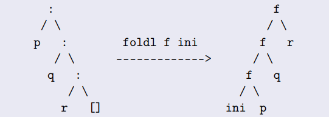

# Свёртки списков. Правая и левая свёртки. Энергичные версии. Развертки.

Давайте посмтрим на эти функции:

``` haskell
sum :: [Integer] -> Integer
sum [] = 0
sum (x:xs) = x + sum xs

allOdd :: [Integer] -> Bool
allOdd [] = True
allOdd (x:xs) = odd x && allOdd xs
```

Мы здесь видим общий шаблон. Что-то делаем пока список не пустой, а потом смотрим что нужно сделать для пустого списка. Давайте это обощим и сделаем правую свертку.

``` haskell
foldr :: (a -> b -> b) -> b -> [a] -> b
foldr f ini [] = ini
foldr f ini (x:xs) = x `f` (foldr f ini xs)
```


То есть мы откусываем head, и делаем операцию f с оставшийся частью списка, и когда остался последний элемент делаем f с ним и ini

Приверы функций выше через foldr

``` haskell
sum' = foldr (+) 0
allOdd' = foldr (\a b -> odd a && b) True
concat = foldr (++) []
-- foldr (:) [] такая свертка возвращает тот же самый список
```

``` haskell
foldl :: (b -> a -> b) -> b -> [a] -> b
foldl f ini [] = ini
foldl f ini (x:xs) = foldl f (ini `f` x) xs
```


В левой свертке используем инициализирующее значения как аккумулятор! А в конце (на пустом списке так как свертка левая) то, что накопили возвращаем. Рекурсия хвостовая (рекурсивный вызов является последней операцией перед возвратом из функции) — оптимизируется. Однако thunk из цепочки вызовов f нарастает. В хаскеле сокращается головной редекс (так как вычисления ленивые) поэтому (ini `f` x) работать не будет. То есть пока список не пустой - вычислений нет! Но из-за этого у нас есть цепочка вычислений, которая занимает память - thunk.

 Рассмотрим другую реализацию foldl
``` haskell
foldl' :: (b -> a -> b) -> b -> [a] -> b
foldl' f ini [] = ini
foldl' f ini (x:xs) = arg `seq` foldl' f arg xs
		where arg = f ini x
		
⊥ `seq` b = ⊥
a `seq` b = b
```

Теперь thunk из цепочки вызовов f не нарастает — вычисление arg форсируется на каждом шаге. Это самая эффективная свертка.

Но! Левые свертки не работают на бесконечных списках, так как foldl вызывает сам себя и не дает поработать сворачивающей функции, следовательно на бесконечном списке она будет разростаться и никогда не остановитс. А вот foldr так как сворачивающаяся функция работает. Рассмотрим на примере

``` haskell
any :: (a -> Bool) -> [a] -> Bool
any p = foldr (\x b -> p x || b) False

any (== 2) [1..]
→ foldr (\x b -> (== 2) x || b) False (1 : [2..])
→ (\x b -> (== 2) x || b) 1
(foldr (\x b -> (== 2) x || b) False [2..])
→ False || (foldr (\x b -> (== 2) x || b) False [2..])
→ foldr (\x b -> (== 2) x || b) False 2 : [3..]
→ True || (foldr (\x b -> (== 2) x || b) False [3..])
→ True
```

## Развертка

``` haskell
unfoldr :: (b -> Maybe (a, b)) -> b -> [a] -- без Maybe нет способа остановиться
unfoldr g ini
	| Nothing <- next = []                   -- остановили процесс
	| Just (a,b) <- next = a : unfoldr g b   -- продолжаем
	where next = g ini
```

``` haskell
GHCi> helper x = if x==0 then Nothing else Just (x,x-1) -- Nothing говорит, когда оставновится
GHCi> unfoldr helper 10
[10,9,8,7,6,5,4,3,2,1]
```